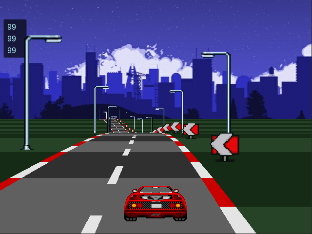

## TURBO TRACK 2D

Pseudo 3D Racing.
60 FPS with no shaders.

### Prototype of 2D arcade style racing game

Small prototype of arcade style racing game with polygon projection technique

Inspired by:

https://www.youtube.com/watch?v=N60lBZDEwJ8

Technical Details:

1. https://codeincomplete.com/articles/javascript-racer/
2. http://www.extentofthejam.com/pseudo/

Tread to disscuss:

https://forum.unity.com/threads/using-unity-to-create-pseudo-3d-graphics.378826/

## Demo

- Arow keys to drive
- Tab to accelerate

https://github.com/h8man/TurboTrack2D/releases/tag/0.1a

>> NOTE: All sprite graphics are placeholder graphics used here as teaching examples. Do not use or distribute these sprites!
